# 게시판 프로젝트
## SpringBoot를 활용한 게시판 프로젝트(2025-02-20 ~) 
>백엔드 기초를 다지기 위한 게시판 프로젝트입니다.

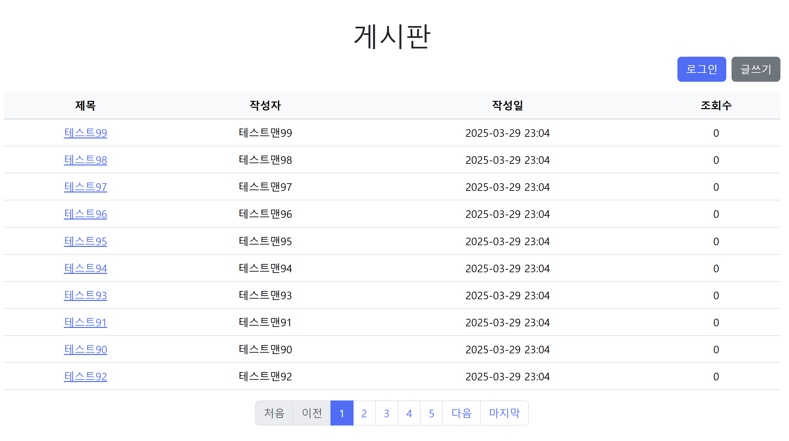
## 목차
+ [프로젝트 소개](#1-프로젝트-소개)
+ [프로젝트 기능](#2-프로젝트-기능)
+ [사용 기술](#3-사용-기술)
  + [백엔드](#백엔드java)
  + [프론트엔드](#프론트엔드)
+ [실행화면](#4-실행-화면)
+ [구조 및 설계](#5-구조-및-설계)
  + [API 설계](#api-명세서)
  + [DB 설계](#데이터베이스-erd)

## 업데이트  
+ 3/27 게시판 수정기능 추가
+ 3/29 게시판 페이징 추가
+ 3/31 조회수 기능 추가
+ 3/31 게시판 삭제기능 추가
## 추가할 기능
+ 댓글 기능
+ 게시글 수정하면 수정 날짜갱신

# 1. 프로젝트 소개
게시판 프로젝트는 백엔드 기본기를 다지기 좋은 프로젝트이며 전반적인 웹 흐름에 대해 공부하기 위해 프로젝트를 만들게 되었습니다.

# 2. 프로젝트 기능
+ 회원가입 / 회원가입 검증  
+ 로그인 / 로그인 검증  
+ 게시판작성 / 제목,내용 검증
+ 게시판 조회/수정
+ 게시판 페이지 목록(3/29 추가)
+ 게시판 삭제(3/31 추가)

# 3. 사용 기술
### 백엔드(JAVA 17)
프레임워크 / 라이브러리  
+ SpringBoot 3.4.2
+ Jpa
+ Lombok

### 프론트엔드
+ HTML/CSS
+ BootStrap 5.3.3
+ Thymeleaf
### 데이터베이스
+ H2 database

# 4. 실행 화면

실행화면 상세보기

### 로그인 화면
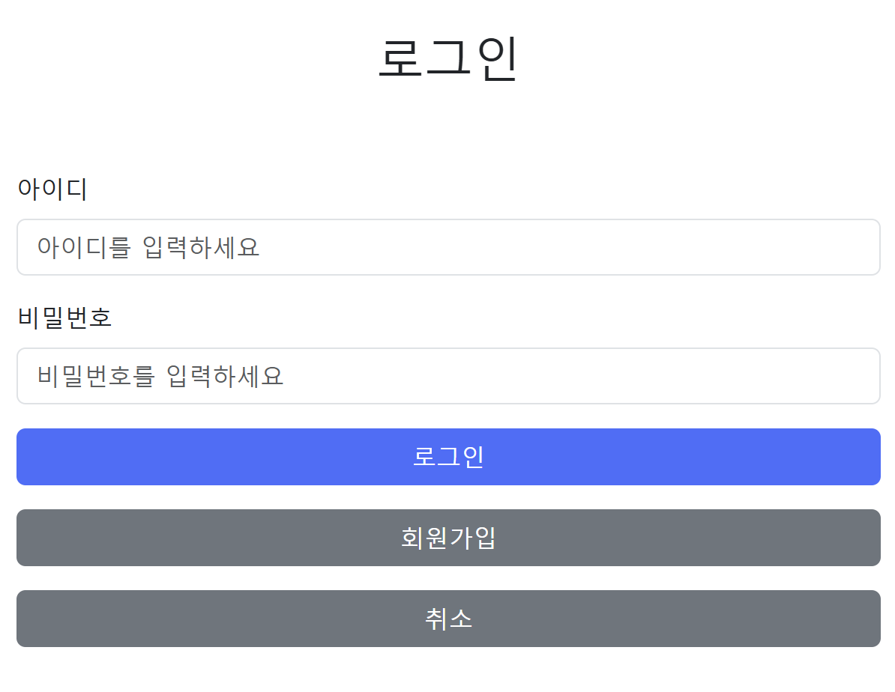

### 로그인 검증화면
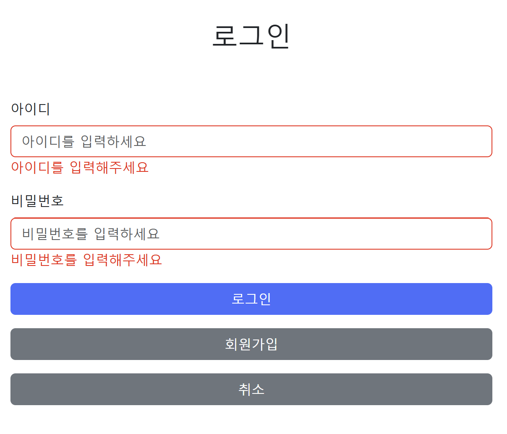

### 회원가입 화면
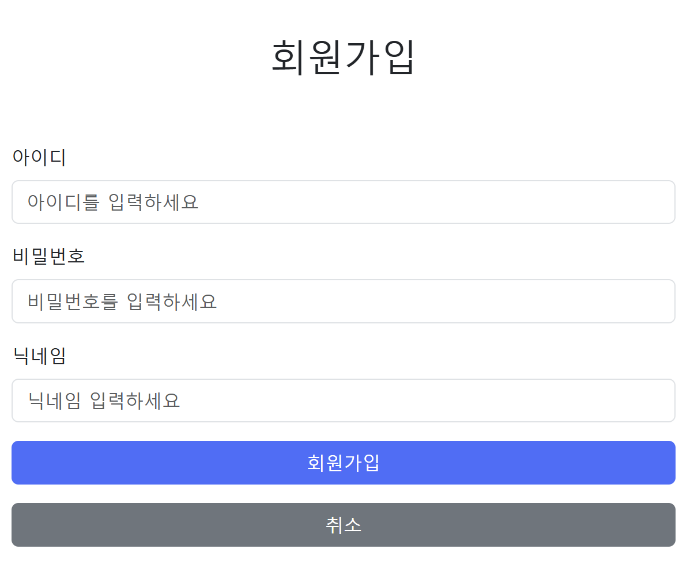

### 회원가입 검증화면
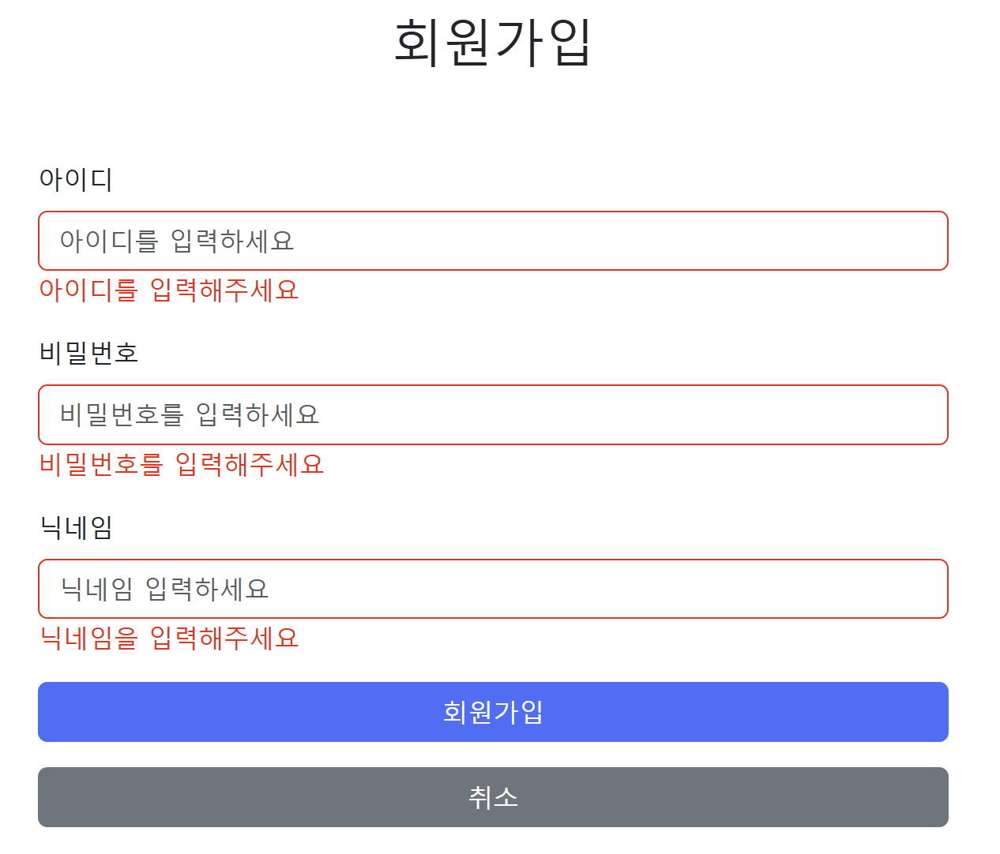

### 게시글 작성화면
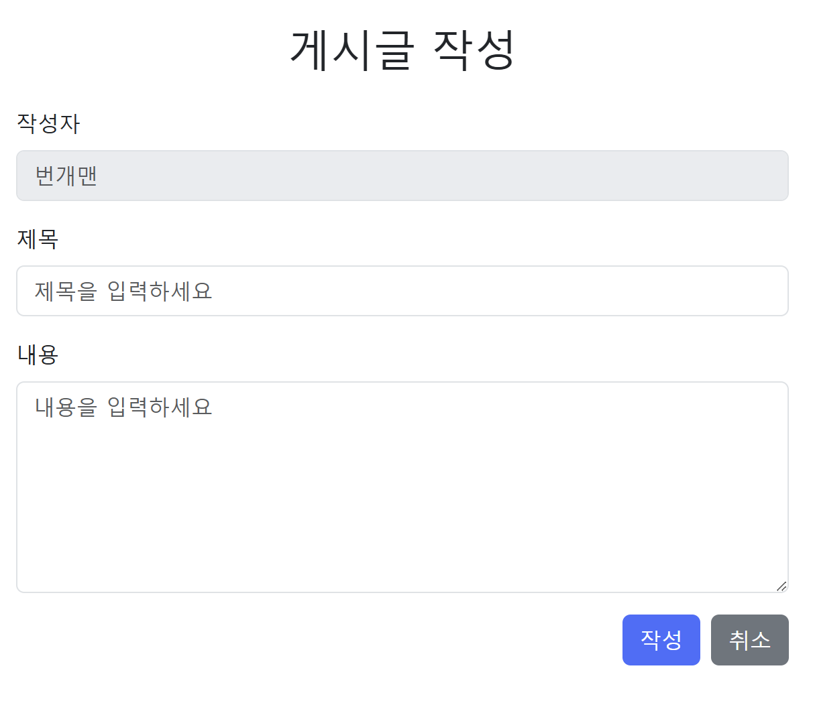

### 로그인 메인화면
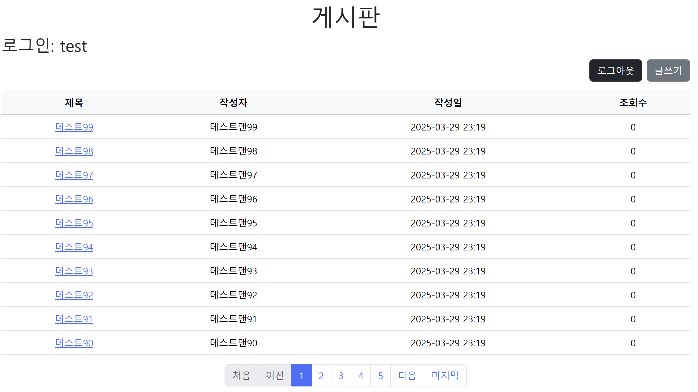
### 게시글 상세보기
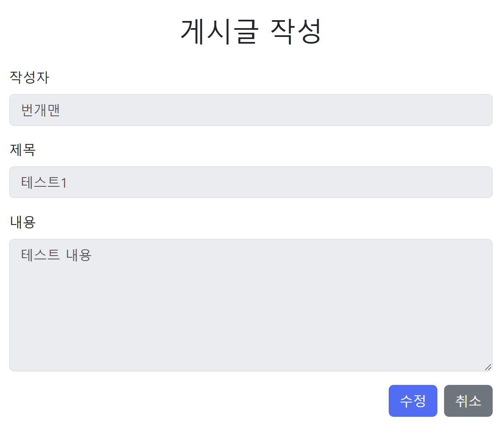
### 게시글 수정
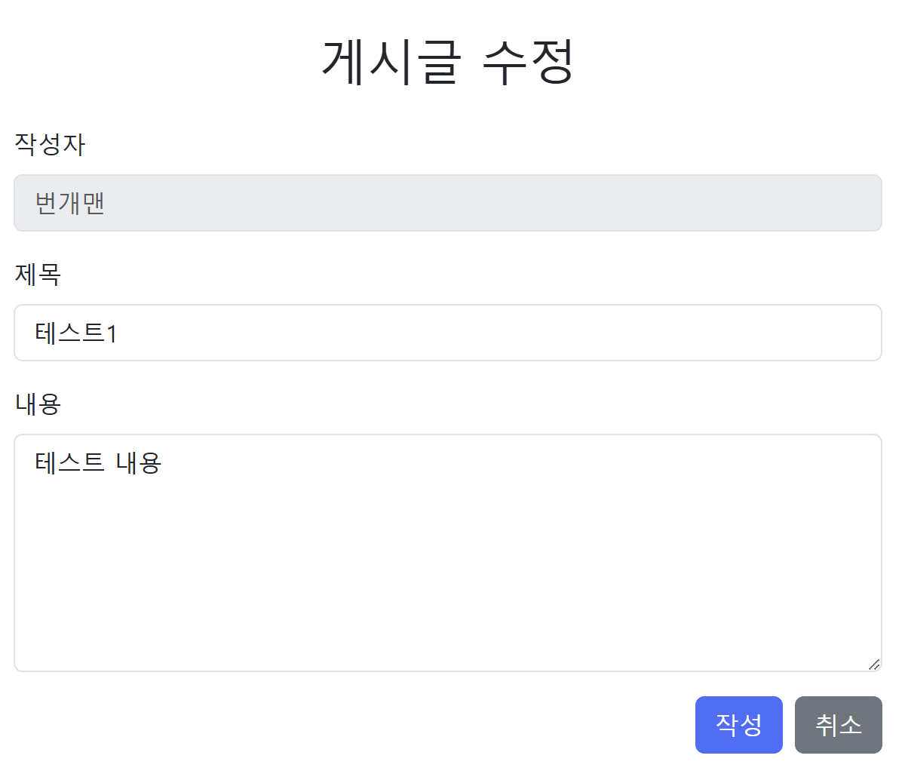

# 5. 구조 및 설계

### API 명세서

API 명세서 상세보기

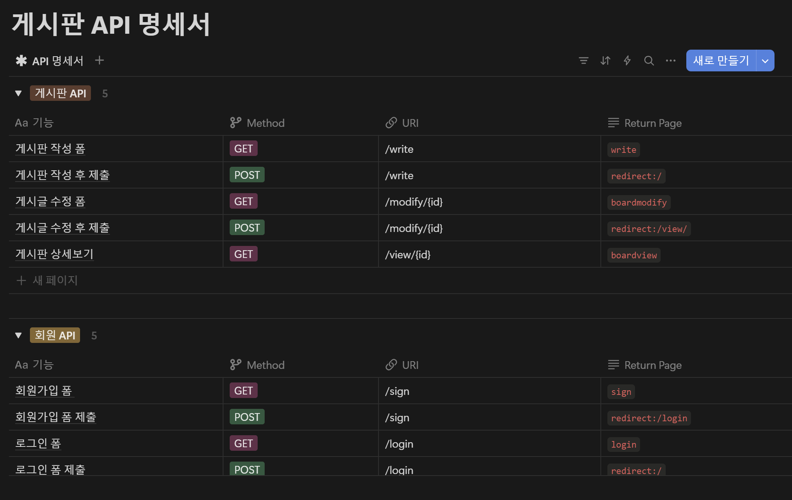

### 데이터베이스 ERD

ERD 상세보기

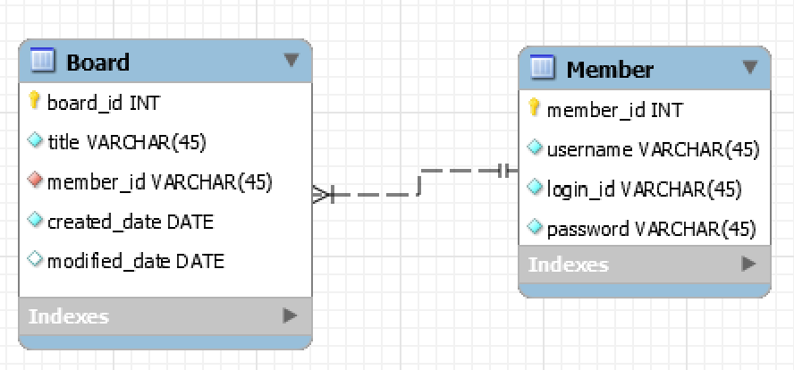

