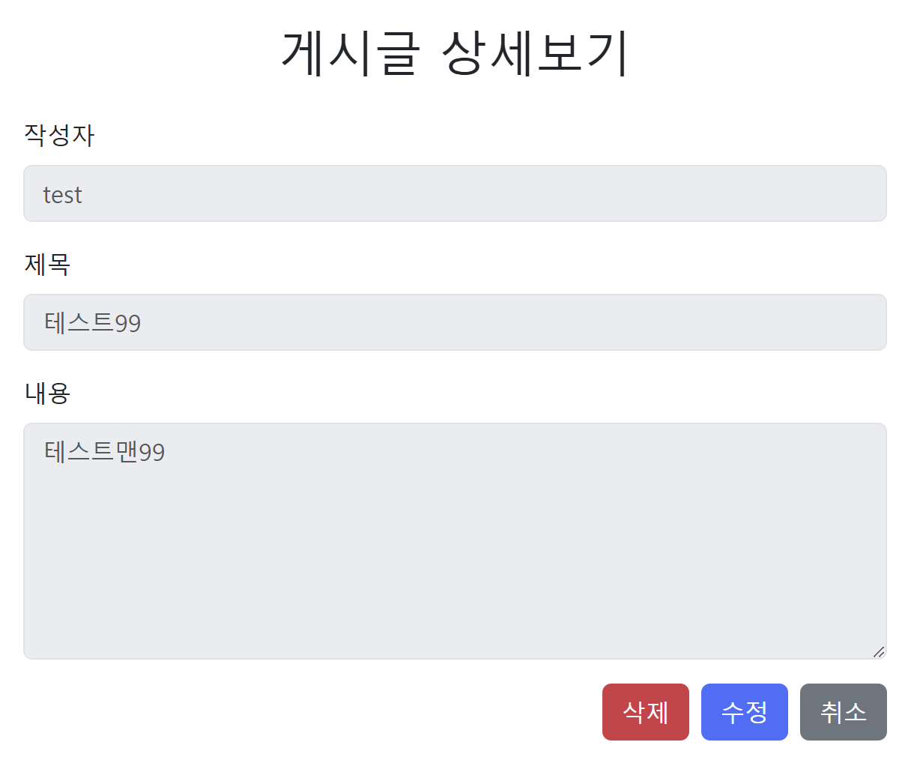

# 게시판 프로젝트
## SpringBoot를 활용한 게시판 프로젝트(2025-02-20 ~) 
>백엔드 기초를 다지기 위한 게시판 프로젝트입니다.

## 목차
+ 프로젝트 소개
+ 프로젝트 기능
+ 사용 기술
  + 백엔드
  + 프론트엔드
+ 실행화면
+ 구조 및 설계
  + API설계
  + DB설계

# 1. 프로젝트 소개
게시판 프로젝트는 백엔드 기본기를 다지기 좋은 프로젝트이며 전반적인 웹 흐름에 대해 공부하기 위해 프로젝트를 만들게 되었습니다.

# 2. 프로젝트 기능

# 3. 사용 기술
### 백엔드(JAVA)
프레임워크/라이브러리  
+ SpringBoot
+ Jpa
+ Lombok

### 프론트엔드
+ HTML/CSS
+ BootStrap

# 4. 실행 화면
### 로그인 화면

### 로그인 검증화면

### 회원가입 화면

### 회원가입 검증화면

### 게시글 작성화면

### 로그인 메인화면

### 게시글 상세보기

### 게시글 수정

